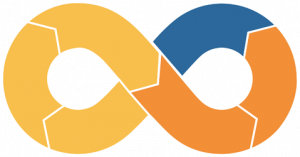
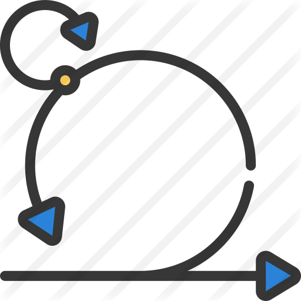

[:fr: French version](/)

## :man: Whoami 

Currently I work for Harmonie Mutuelle as software architect.

For several years, I have been involved in setting up development bases for project teams (java, angular, esb, etc.) and providing support to them to best support them in the adoption of these technologies.

This support is reflected, by the creation and the share of  *inner-source* Frameworks.

I maintain and upgrade the CI / CD chain based on Jenkins 2 (pipeline as code in Groovy).
In addition to these pipelines, I am participating in the deployment of OpenShift.
This allows me to facilitate my other role which is to facilitate the adoption of DevOps principles within my company.

I'm still a passionate developer for over 20 years, mainly in Java (JEE, Spring, ...) but also in other languages ​​such as Groovy, Typescript (Angular), ...

Sharing and transmission are for me two essential things in my approach to the developer profession, which is why I co-created the association [TADx] (https://www.tadx.fr) which has for objective of organizing a monthly session of presentations made by speakers around agility, DevOps but also all the human relations in the development jobs.

Always in the knowledge sharing, I realize as a speaker, internal conferences in my company but also some external conferences ([Touraine Tech] (https://touraine.tech/) and [codeurs en seine] (https://touraine.tech/)).

### :point_right: Skills
#### Languages / Frameworks
&nbsp;&nbsp; &nbsp;&nbsp; 
&nbsp;&nbsp; 
&nbsp;&nbsp;
&nbsp;&nbsp;

#### Tools
&nbsp;&nbsp; &nbsp;&nbsp; 
&nbsp;&nbsp; 
&nbsp;&nbsp; 
&nbsp;&nbsp; 
&nbsp;&nbsp; 
&nbsp;&nbsp; 
&nbsp;&nbsp; 
 

#### Methods / Frameworks
&nbsp;&nbsp;  

| Few statistics | | |
| :---: |:---:| :---:|
|      |  |  |

    

        Detailled resume
    

## WORK EXPERIENCE
### 2008 – Today | Software and DevOps architect | Harmonie-Mutuelle
Design of JEE, Angular, Business Works (ESB) and SpringBoot (as well as SpringBatch) development platforms for intranet and Internet application development. Development of internal Frameworks (SpringBoot & Angular). 
Design and realization of the continuous integration platform based on Jenkins 2 (especially with pipelines), Sonarqube, Artifactory and GitHub.

Design of SOA for applications.

Implementation of OpenShift to containerize the applications deployed in production (CI / CD part and containerization of developments).

Support of production and project teams in setting up DevOps approach.

Product Owner for various technical or application projects (internal application to facilitate access to CI / CD, setting up of bases, ...).

### 2006 – 2008 | Java / JEE software engineer | Apside TOP
JEE expert t Coface Services for setting up web applications and increasing the skills of internal staff. Role of tech lead within teams.

###  2004 – 2006 | Technical project lead | Delta Informatique
Setting up of websites (banking and insurance sector) in JEE (deployed on Weblogic) as expert developer then technical project manager (technical specifications, development and implementation at clients' sites) on the same technologies.

### 2002 – 2004 | Java / JEE software engineer | Prima Solutions
Front end and back end development in the insurance sector and for the assurland.com site. 
Customer support for the deployment of JEE / Weblogic solutions.

## EDUCATION
### 1999 – Computer engineer – Polytech Tours
Engineer computer school.

### 1996 – DUT Informatique – Orléans - Tours university
Management IT graduation.

### 1993 – BAC D – Lycée Claude de France à Romorantin
General course option biology.

### Languages
:fr: :gb:

### Interests
Badminton, Running, Cinema, Concerts

